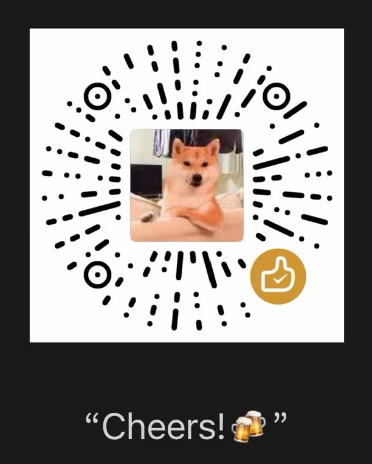

- [🇨🇳 简体中文](README.zh-CN.md)
- [🇺🇸 English](README.md)

# Synapulse

**Synapulse** 连接您与行业前沿。

- 收集：从指定的信息源（邮箱简报、X账号、Reddit等）自动抓取原始信息
- 分析：AI 智能筛选、去重、提炼核心观点，生成结构化摘要
- 发送：按预先设定的时间（每日/每周）和渠道（邮件/飞书等）准时送达


## 功能特性

- **模块化架构**：Collector（收集器）、Processor（处理器）、Sender（发送器）均可插拔替换
- **多领域支持**：可配置多个领域（科技、金融、医疗等），每个领域独立处理
- **多实例支持**：同一类型可配置多个实例，敏感信息通过独立环境变量注入
- **配置驱动**：YAML 配置文件 + Markdown 提示词，提示词与配置分离
- **环境变量注入**：敏感信息使用 `${ENV_VAR_NAME}` 占位符，安全可靠

## 项目结构

```
Synapulse/
├── app/                        # 应用代码目录
│   ├── conf/                   # 配置文件目录
│   │   ├── config.yaml         # 配置文件（不提交）
│   │   └── config.example.yaml # 配置示例
│   ├── prompts/                # 提示词目录
│   │   └── tech.md             # 科技领域提示词
│   ├── src/                    # 源代码
│   │   ├── main.py             # 主入口
│   │   ├── models.py           # 数据模型
│   │   ├── config_loader.py    # 配置加载器
│   │   ├── summarizer.py       # 主控制器
│   │   ├── collectors/         # 收集器
│   │   │   ├── base.py
│   │   │   └── email_collector.py
│   │   ├── processors/         # 处理器
│   │   │   ├── base.py
│   │   │   └── ai_processor.py
│   │   ├── senders/            # 发送器
│   │   │   ├── base.py
│   │   │   └── email_sender.py
│   │   └── utils/              # 工具类
│   │       ├── logger.py
│   │       └── html_cleaner.py
│   └── tests/                  # 测试目录
│       └── test_email_collector.py
├── .github/workflows/           # GitHub Actions
│   └── daily_summary.yml       # 每日定时任务
├── pyproject.toml
└── README.md
```

## 快速开始

### 1. 克隆项目

```bash
git clone <repository-url>
cd synapulse
```

### 2. 安装依赖

```bash
uv sync
```

### 3. 配置

编辑 `app/conf/config.yaml`，配置以下内容：

- **收集器**：IMAP 邮件配置（邮箱账号、密码、环境变量占位符）
- **处理器**：AI API 配置（provider、api_base、api_key、model）
- **发送器**：SMTP 配置（发件箱、收件人、密码）

### 4. 设置环境变量

根据配置文件中的占位符设置对应的环境变量：

```bash
# 邮箱账号和密码
export EMAIL1_ACCOUNT="your-email@gmail.com"
export EMAIL1_PASSWORD="your-email-password"

# AI API Key
export LLM1_API_KEY="your-deepseek-api-key"

# 发件箱和收件人
export EMAIL3_ACCOUNT="sender@gmail.com"
export EMAIL3_PASSWORD="your-sender-password"
export RECEIVER_EMAIL="receiver@example.com"
```

### 5. 运行

```bash
uv run python -m app.src.main
```

## 配置说明

### 全局配置

```yaml
global:
  timezone: "Asia/Shanghai"    # 时区
  log_level: "INFO"            # 日志级别
```

### 领域配置

```yaml
domains:
  - name: "tech"              # 领域名称
    collectors:               # 收集器列表
      - name: "EMAIL1"
        type: email
        imap_server: "imap.gmail.com"
        email_account: "sub@gmail.com"
        email_password: "${PASSWORD_EMAIL1}"
        mailbox: "INBOX"
        mark_as_seen: true
        time_range_days: 1
    processor:                # 处理器
      type: ai
      name: "LLM1"
      provider: "deepseek"
      api_base: "https://api.deepseek.com/v1"
      api_key: "${LLM1_API_KEY}"
      model: "deepseek-chat"
      prompt_file: "app/prompts/tech.md"
    sender:                   # 发送器
      type: email
      name: "EMAIL2"
      smtp_server: "smtp.gmail.com"
      smtp_port: 465
      sender_email: "sender@gmail.com"
      sender_password: "${EMAIL3_PASSWORD}"
      receiver_email: "daily@example.com"
      subject_prefix: "科技日报"
```

### 环境变量占位符

配置文件中的敏感信息使用 `${ENV_VAR_NAME}` 格式占位符，运行时会自动从环境变量读取。

## 提示词配置

提示词文件位于 `app/prompts/` 目录，使用 Markdown 格式。文件中的 `{combined_content}` 会被替换为收集到的新闻内容。

示例 (`app/prompts/tech.md`)：

```markdown
你是一个科技新闻编辑。请根据以下新闻内容，整理一份今日科技日报。

要求：
- 只提取与AI应用、手机电脑数码产品相关的信息
- 去除重复新闻
- 每条新闻提供核心摘要

新闻内容：
{combined_content}
```

## GitHub Actions 定时任务

项目配置了 GitHub Actions 定时任务，每日 UTC 0 点自动运行。

在 GitHub 仓库设置中添加以下 Secrets：

- `EMAIL1_ACCOUNT`
- `EMAIL1_PASSWORD`
- `LLM1_API_KEY`
- `EMAIL3_ACCOUNT`
- `EMAIL3_PASSWORD`
- `RECEIVER_EMAIL`

## 扩展开发

### 添加新的收集器

1. 在 `app/src/collectors/` 创建新文件，继承 `Collector` 基类
2. 实现 `collect()` 方法
3. 在 `app/src/summarizer.py` 的 `_create_collector()` 中注册

### 添加新的处理器

1. 在 `app/src/processors/` 创建新文件，继承 `Processor` 基类
2. 实现 `process()` 方法
3. 在 `app/src/summarizer.py` 的 `_create_processor()` 中注册

### 添加新的发送器

1. 在 `app/src/senders/` 创建新文件，继承 `Sender` 基类
2. 实现 `send()` 方法
3. 在 `app/src/summarizer.py` 的 `_create_sender()` 中注册

## 赞助

如果你觉得这个项目对你有帮助，欢迎扫码赞助！



## TODO

- [ ] 优化SourceItem结构（urls），统一解析方式（to_str、to_dict...）
- [ ] 改进tech.md提示词，优化生成内容（分类总结、优化信息展示模式）
- [ ] 修复ai_processor偶尔信息提取失败问题
- [x] 优化日志记录模式

## License

MIT
